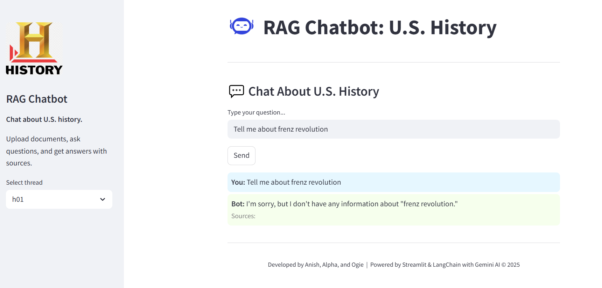

# U.S. History based RAG Chatbot 🚀
A modular Python repository for AI projects, focused on Retrieval-Augmented Generation (RAG) using Google GenAI (Gemini). Built for collaboration and scalability.

## Features

- **Document Ingestion:** Upload and process PDF, DOCX, and TXT files.
- **Vector Search:** Uses ChromaDB for fast semantic retrieval of relevant document chunks.
- **LLM Integration:** Answers are generated using Google Generative AI models, grounded in your documents.
- **User Interface:** Includes a Streamlit web UI for interactive chat and document management.
- **Modular Design:** Core functionalities are separated into distinct modules for easy maintenance and scalability.
---

## Project Hierarchy
```
RAG_APP/
├── core/
│   ├── config.py
│   ├── generation.py
│   ├── prompt.py
│   ├── retrieval.py
│   └── services.py
├── processing/
│   ├── doc_processor.py
│   ├── embeddings.py
├── ui/
│   ├── app.py
│   ├── chat_histories/
│   └── uploads/
├── documents/
├── requirements.txt
└── README.MD
```
---

## Requirements

- **Python Version:**  
  Python 3.10 or higher is recommended.

- **Operating System:**  
  - Windows, macOS, or Linux (tested on Windows 10/11 and Ubuntu 22.04)
  - Streamlit and all dependencies are cross-platform.

- **Dependencies:**  
  - All required Python packages are listed in `requirements.txt`.  
  - Key dependencies include:
    - streamlit
    - langchain
    - langchain-google-genai
    - chromadb
    - tenacity
```Note: All the rquire packages are given in the requirements.txt file, you can install them using pip.```
- **API Keys:**  
  - You must provide a valid Google Generative AI API key in a `.env` file.

- **Hardware:**  
  - No GPU required. Standard CPU and at least 4GB RAM recommended for smooth operation.

---

**Note:**  
For best results, use a modern version of Python and keep your dependencies up to date.  
If you encounter issues on your OS, please open an issue or pull request.

---

## Setup

1. Clone the repository  
   `git clone <the-repo-url>`  
   `cd repo_name`

2. Create and activate a virtual environment  
   `python -m venv .venv`  
   `.venv\Scripts\activate`

3. Install dependencies  
   `pip install -r requirements.txt`

4. Set up environment variables  
   Create a `.env` file in the root directory:  
   `GOOGLE_API_KEY=your_google_api_key`
---
## Running the App
To run the Streamlit app, execute the following command in your terminal:
```bash
`streamlit run RAG_APP/ui/app.py`
```
---
## How it looks

---
**Credits:**  
Developed by Ogie Omorose, Anish Khatiwada, and Alpha Lencho.

**Note:** This app is for educational and research purposes. For production use, review security and privacy best practices.